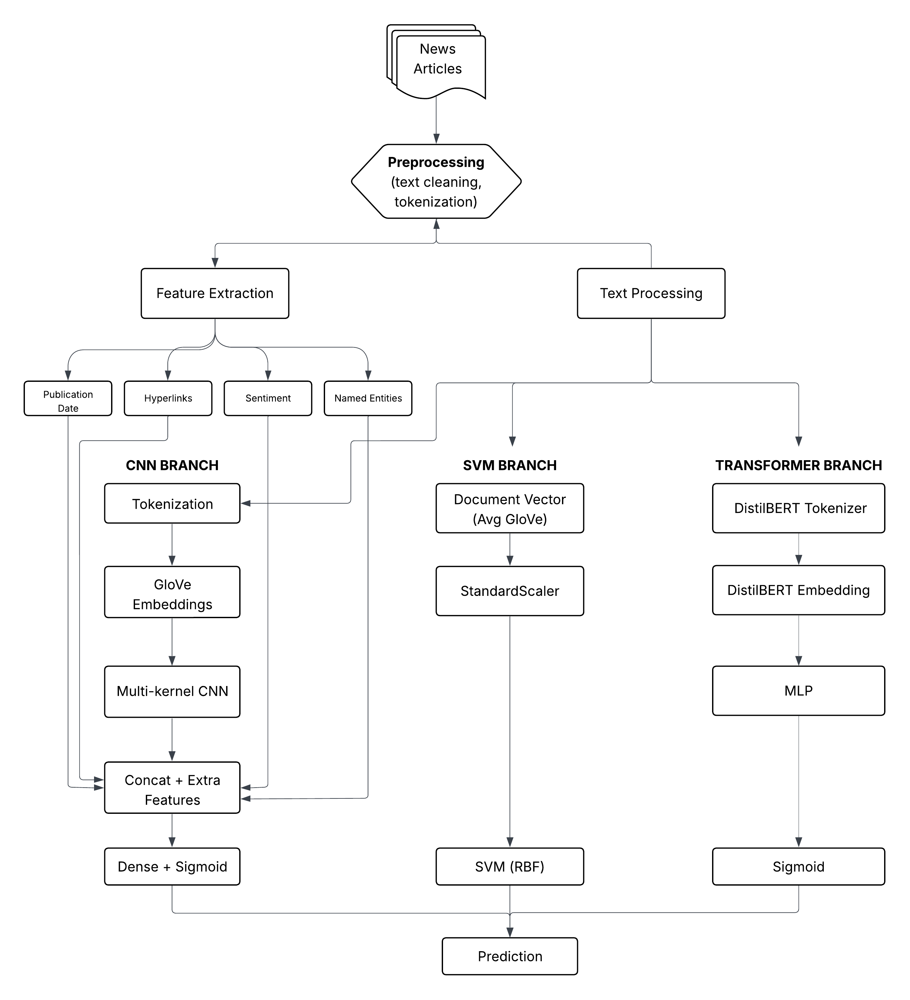

# Explaining Political Bias Classification in News Articles using CNNs and Transformers

A deep learning project for detecting and explaining hyperpartisan (politically biased) news articles. The models are trained on the SemEval-2019 Task 4 Hyperpartisan News Detection dataset.

This repository accompanies the paper _Explaining Political Bias Classification in News Articles using CNNs and Transformers_ (Jensen, Agbesi, Dall-Hansen, 2025).

## Abstract

Detecting political bias in news articles is an increasingly important task in the era of misinformation and polarized media. In this project, we implement multiple approaches for binary classification of news articles as hyperpartisan or mainstream: a CNN with GloVe embeddings, a transformer-based classifier using DistilBERT, and an SVM baseline. Beyond classification, we explore interpretability methods to identify which tokens contribute most to model decisions.

## Pipeline



## Project Structure

```
.
├── preprocess.py      # XML parsing and text preprocessing
├── evaluate.py        # Unified evaluation across all models
├── cnn/               # CNN with GloVe embeddings
│   ├── config.py
│   ├── model.py
│   ├── train.py
│   └── evaluate.py
├── transformer/       # DistilBERT embeddings + classifier
│   ├── config.py
│   ├── model.py
│   ├── train.py
│   └── evaluate.py
├── svm/               # SVM baseline (averaged GloVe + RBF kernel)
│   ├── config.py
│   ├── train.py
│   └── evaluate.py
└── cache/             # Preprocessed data and model checkpoints
```

## Installation

```bash
pip install -r requirements.txt
```

## Dataset

The dataset is automatically downloaded from Zenodo on first run. Alternatively, download from [SemEval-2019 Task 4](https://pan.webis.de/semeval19/semeval19-web/).

## Usage

### Preprocessing

```bash
python preprocess.py
```

### Training

```bash
python -m cnn.train
python -m transformer.train
python -m svm.train
```

### Evaluation

Evaluate all models:

```bash
python evaluate.py
```

Or evaluate individually:

```bash
python -m cnn.evaluate
python -m transformer.evaluate
python -m svm.evaluate
```

## Results

| Model       | Approach                    | By-Article Acc |
| ----------- | --------------------------- | -------------- |
| CNN         | GloVe + multi-kernel CNN    | ~0.65          |
| Transformer | DistilBERT embeddings + MLP | ~0.82          |
| SVM         | Averaged GloVe + RBF kernel | ~0.81          |

### Reference (SemEval-2019)

| Team               | Approach    | By-Article Acc |
| ------------------ | ----------- | -------------- |
| Bertha von Suttner | ELMo + CNN  | 0.822          |
| Tom Jumbo Grumbo   | GloVe + SVM | 0.806          |

## Configuration

See `cnn/config.py`, `transformer/config.py`, and `svm/config.py` for hyperparameters.
